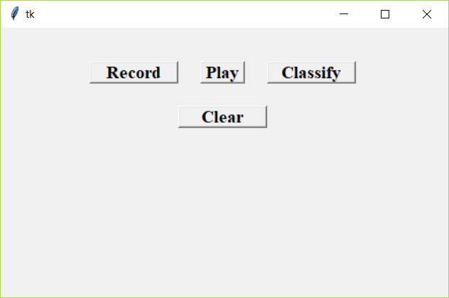

# Guitar-Chords-recognition
An application that predicts the chords when melspectrograms of guitar sound is fed into a CNN.

## Dataset
The chords dataset was collected from MONTEFIORE RESEARCH GROUP of University of Liège - Montefiore Institute (Montefiore.ulg.ac.be, 2019). The chords dataset consists of 10 types of chords with 200 audio files of each chord.
### download link: http://www.montefiore.ulg.ac.be/services/acous/STSI/file/jim2012Chords.zip

## Libraries required:
1. numpy
2. keras
3. librosa
4. tensorflow
5. pandas
6. tkinter
7. pygame

## How to run:
Just install the required libraries and run classify.py

### chord_recognition.ipynb 
It creates the trained model model.json for prediction of guitar chords

### classify.py
It uses the trained model model.json to predict a recorded guitar chord using a simple UI. In the UI, just press reocrd and play a chord. It records for 3 seconds and saves the output wav file recoeded.wav. The classify button shows the predicted chord.

