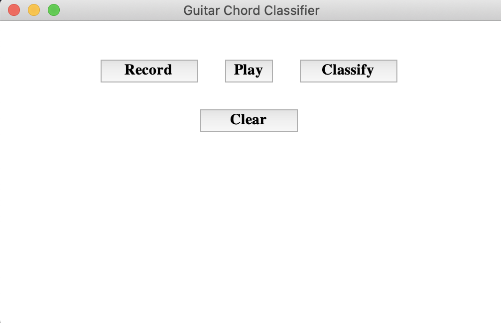
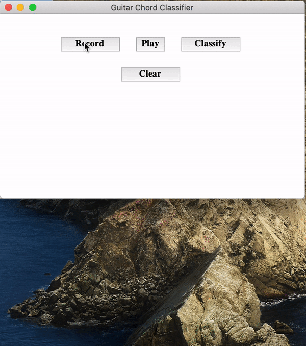

# Guitar-Chords-recognition
An application that predicts the chords when melspectrograms of guitar sound is fed into a CNN.

## Setting up the project

### 1. Clone the repo

```console
$ git clone https://github.com/ayushkumarshah/Guitar-Chords-recognition.git
$ cd Guitar-Chords-recognition
```

If you are using linux system, switch to linux branch:

```console
$ git checkout linux
```

### 2. Installation

### Option 1: Using Conda - Recommended

- Download and install [miniconda](https://docs.conda.io/projects/conda/en/latest/user-guide/install/) or
  [anaconda](https://docs.anaconda.com/anaconda/install/) if you don't have conda installed in your system.

- Create a new environment 'tf' using the following command:

    ```console
    $ conda env create -f environment.yml
    ```

    If an error like the one shown below occurs:

    ```console
    ResolvePackageNotFound:
        - appnope=0.1.0
        - libcxx=4.0.1
    ```

    Just remove those packages from the file `environment.yml` and rerun the above command. Then activate the
    environment by

    ```
    $ conda activate tf
    ```
- If you face trouble installing packages, yoou may install using `setup.sh`

    ```console
    $ chmod +x setup.sh
    $ ./setup.sh
    ```

### Option 2: Using Virtual Environment

- Install and virtualenv using pip and create a virtual environment '.venv'

    ```console
    $ pip install virtualenv
    $ virtualenv .venv
    ```

- Activate the virtual environment '.venv' and install required packages

    ```console
    $ source .venv/bin/activate
    $ pip install -r requirements.txt
    ```

## Configuring the Chords Classifier App (classifier.py)

It uses the trained model `models/model.json` to predict a recorded guitar chord.

- First, check the info of the audio recording device of your system by running

    ```console
    $ python -m src.rec_device_info
    ```

    You will receive output something like this:

    ```console
    [('index', 0), ('name', 'MacBook Pro Microphone'), ('maxInputChannels', 1), ('defaultSampleRate', 44100.0)]

    [('index', 1), ('name', 'MacBook Pro Speakers'), ('maxInputChannels', 0), ('defaultSampleRate', 44100.0)]
    ```

- Note down the `index`, `maxInputChannels` and  `defaultSampleRate` of your recording device or microphone (eg. MacBook
  Pro Microphone). In my system. it is

    ```console
    index = 0
    maxInputChannels = 1
    defaultSampleRate = 44100.0
    ```

- Open `src/classify.py` and modify the values accordingly in line numbers 77, 78 and 91

    ```python
    CHANNELS = 1
    RATE = 44100
    ...
    stream = audio.open(
                    ...
                    frames_per_buffer=CHUNK,
                    input_device_index=0)
                    )
    ```

## Running the Chords Classifier App (classifier.py)

- Execute the python file 'classify.py'

    ```console
    $ python -m src.classify
    ```

- A window is launched as shown below: 

    

- Click record and play a chord. It records for 3 seconds and saves the output wav file to `recording/recorded.wav`. 

- Click play to listen to the recorded sound. 

- Click classify to view the predicted chord along with the melspectrogram of the recorded chord.

- Click clear to record another chord.

See the demo below:
    <div align = 'center'>
        <a href = 'https://www.youtube.com/watch?v=DOCVIk9Ocys'>
            
        </a>
    </div>

> Click the above video to to go to YouTube and hear the sound as well.

## Training the model (Optional)

If you want to experiment by training the model yourself with your own data or the data used currently, follow the steps
below:

### 1. Download the Dataset or Use your own dataset

The chords dataset was collected from MONTEFIORE RESEARCH GROUP of University of Liège - Montefiore Institute (Montefiore.ulg.ac.be, 2019). The chords dataset consists of 10 types of chords with 200 audio files of each chord.

Run download_data.sh to download the dataset:

```console
$ chmod +x download_data.sh
$ ./download_data.sh
```

### 2. Run `train.py`

```console
$ python -m src.train
```

>You can view the logs in the file `logs/info.log`

To view the real-time tensorboard logging, type the command:

```console
$ tensorboard --logdir logs/training
```

Then open your browser and goto [localhost:6006](http://localhost:6006) to
visualize the training.

You will see something like this:


## License

Guitar-Chords-recognition is licensed under the [GNU GPLv3](https://www.gnu.org/licenses/gpl-3.0.en.html) license.
