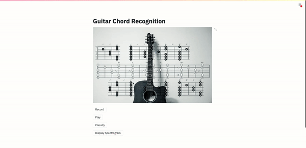
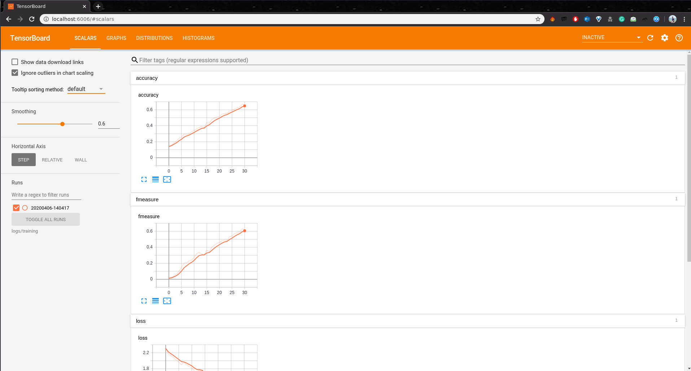

# Guitar-Chords-recognition
An application that predicts the chords when melspectrograms of guitar sound is fed into a CNN.

## Setting up the project

### 1. Clone the repo

```console
$ git clone https://github.com/ayushkumarshah/Guitar-Chords-recognition.git
$ cd Guitar-Chords-recognition
```

If you are using linux system, switch to linux branch:

```console
$ git checkout linux
```

### 2. Installation

> You can install the required packages using any **`one of the 3 options`** below. However, **`Option 1`** is recommended.

### Option 1: Using Conda - Recommended

- Download and install [miniconda](https://docs.conda.io/projects/conda/en/latest/user-guide/install/) or
  [anaconda](https://docs.anaconda.com/anaconda/install/) if you don't have conda installed in your system.

- Create a new environment 'tf' using the following command:

    ```console
    $ conda env create -f environment.yml
    ```

    If an error like the one shown below occurs:

    ```console
    ResolvePackageNotFound:
        - appnope=0.1.0
        - libcxx=4.0.1
    ```

    Just remove those packages from the file `environment.yml` and rerun the above command. Then activate the
    environment by

    ```console
    $ conda activate tf
    ```

### Option 2: Using setup.sh

- If you face trouble installing packages, you may install using `setup.sh`. If you use bash shell instead of zsh, edit
  line 2 of `setup.sh` by replacing zsh with bash. i.e. 

  ```shell
  eval "$(conda shell.zsh hook)"
  ```

  Then run the following commands

    ```console
    $ chmod +x setup.sh
    $ ./setup.sh
    ```

### Option 3: Using Virtual Environment

- Install virtualenv using pip and create a virtual environment '.venv'

    ```console
    $ pip install virtualenv
    $ virtualenv .venv
    ```

- Activate the virtual environment '.venv' and install required packages

    ```console
    $ source .venv/bin/activate
    $ pip install -r requirements.txt
    ```

## Configuring the Chords Classifier App (classifier.py)

It uses the trained model `models/model.json` to predict a recorded guitar chord.

- First, check the info of the audio recording device of your system by running

    ```console
    $ python -m src.sound
    ```

    You will receive output something like this:

    ```console
   pygame 1.9.6
    Hello from the pygame community. https://www.pygame.org/contribute.html
    src.sound - INFO - List of System's Audio Devices configurations:
    src.sound - INFO - Number of audio devices: 2
    src.sound - INFO - [('index', 0), ('name', 'MacBook Pro Microphone'), ('maxInputChannels', 1), ('defaultSampleRate', 44100.0)]
    src.sound - INFO - [('index', 1), ('name', 'MacBook Pro Speakers'), ('maxInputChannels', 0), ('defaultSampleRate', 44100.0)]

    src.sound - INFO - Audio device configurations currently used
    src.sound - INFO - Default input device index = 0
    src.sound - INFO - Max input channels = 1
    src.sound - INFO - Default samplerate = 44100
    ```

- Check if the `index`, `maxInputChannels` and  `defaultSampleRate` of your recording device or microphone (eg. MacBook
  Pro Microphone) matches with the device configurations currently used (both displayed in the output). The
  configurations for my recording device is:

    ```console
    index = 0
    maxInputChannels = 1
    defaultSampleRate = 44100.0
    ```

- Open `settings.py` and modify the values accordingly in line numbers 38 to 40

    ```python
    # Audio configurations
    INPUT_DEVICE = 0
    MAX_INPUT_CHANNELS = 1  # Max input channels
    DEFAULT_SAMPLE_RATE = 44100   # Default sample rate of microphone or recording device
    ```

## Running the Guitar Chords Recognition Webapp

- Execute the python file `app.py` using streamlit

    ```console
    $ streamlit run app.py
    ```

- The webapp is launched in your browser and opened automatically as shown below. You may also open it by visiting [http://localhost:8501](http://localhost:8501)

    <div align = 'center'>
        <a href = 'https://www.youtube.com/watch?v=KJ4sJupEfpg'>
            
        </a>
    </div>

    > Click the above video to to go to YouTube and hear the sound as well.

- Click `Record` and play a chord in your guitar. It records for 3 seconds and saves the output wav file to `recording/recorded.wav`. 

- Click `Play` to listen to the recorded sound. 

- Click `Classify` to view the predicted chord along with the melspectrogram of the recorded chord.

- Click `Display Spectrogram` to display the spectrogram of the recorded chord.

## Training the model (Optional)

If you want to experiment by training the model yourself with your own data or the data used currently, follow the steps
below:

### 1. Download the Dataset or Use your own dataset

The chords dataset was collected from MONTEFIORE RESEARCH GROUP of University of Liège - Montefiore Institute (Montefiore.ulg.ac.be, 2019). The chords dataset consists of 10 types of chords with 200 audio files of each chord.

Run download_data.sh to download the dataset:

```console
$ chmod +x download_data.sh
$ ./download_data.sh
```

### 2. Run `train.py`

```console
$ python -m src.train
```

>You can view the training logs in the file `logs/info.log`

To view the real-time tensorboard logging, type the command:

```console
$ tensorboard --logdir logs/training
```

Then open your browser and goto [localhost:6006](http://localhost:6006) to
visualize the training.

You will see something like this:



### 3. Run `test.py`

You can test the performance of your model after the training by running:

```conosle
$ python -m src.test
```

## Report Issues 
If you have any issues with the app, please report it here: [Issues](https://github.com/ayushkumarshah/Guitar-Chords-recognition/issues)

## License

Guitar-Chords-recognition is licensed under the [GNU GPLv3](https://www.gnu.org/licenses/gpl-3.0.en.html) license.
